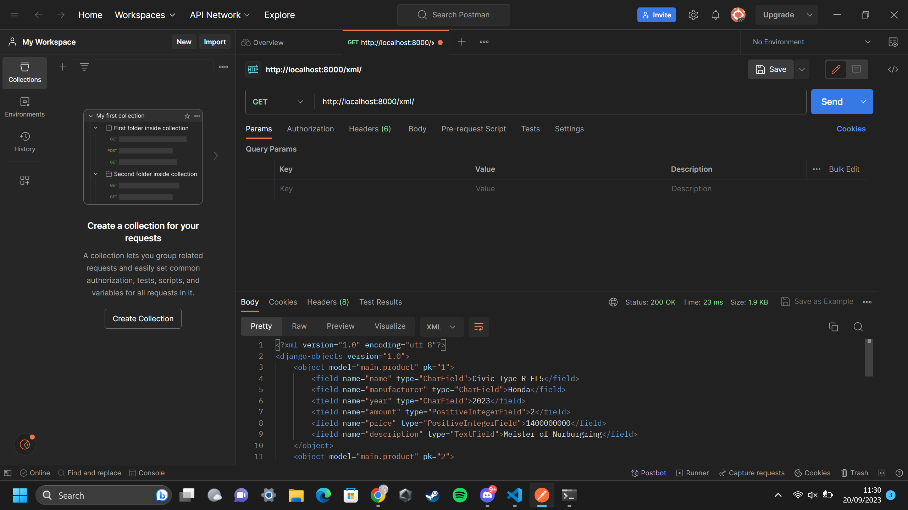
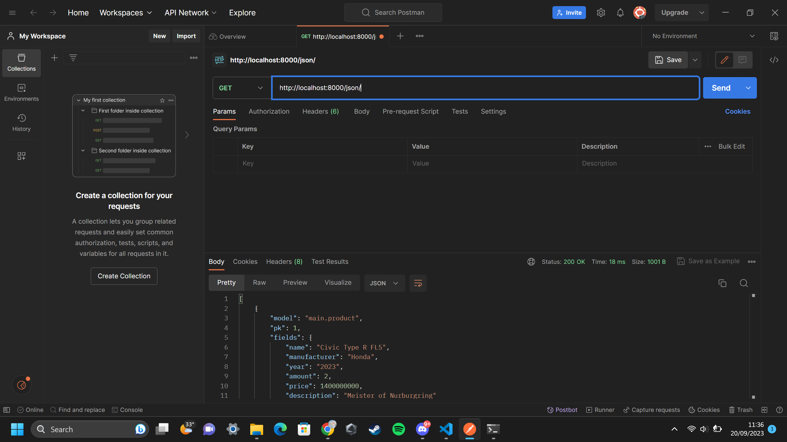
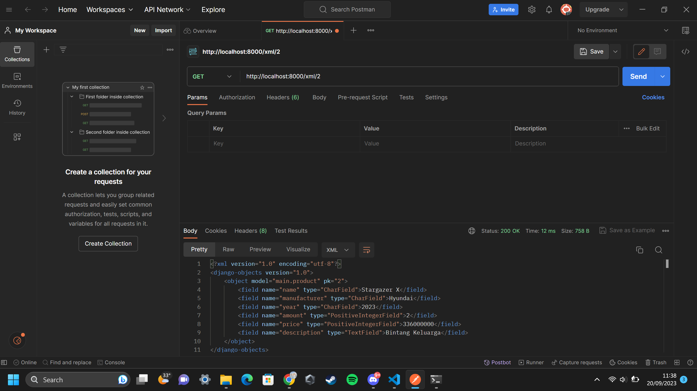
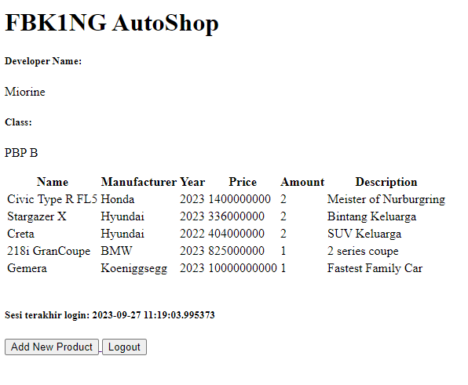
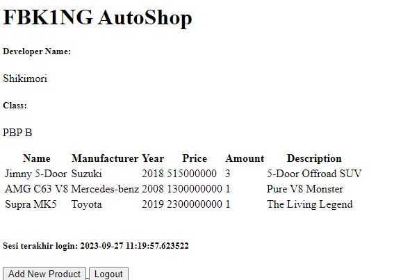

LINK APP ADAPTABLE --> fbk1ngautoshop.adaptable.app

#  TUGAS 2  #
PERTANYAAN
1. Jelaskan bagaimana cara kamu mengimplementasikan checklist di atas secara step-by-step (bukan hanya sekadar mengikuti tutorial).
2. Buatlah bagan yang berisi request client ke web aplikasi berbasis Django beserta responnya dan jelaskan pada bagan tersebut kaitan antara urls.py, views.py, models.py, dan berkas html.
3. Jelaskan mengapa kita menggunakan virtual environment? Apakah kita tetap dapat membuat aplikasi web berbasis Django tanpa menggunakan virtual environment?
4. Jelaskan apakah itu MVC, MVT, MVVM dan perbedaan dari ketiganya.

JAWABAN
1. a. Membuat proyek django baru --> untuk membuat sebuah proyek django baru, saya mengaktifkan virtual environment dahulu. Kemudian saya    membuat file baru seperti requirements.txt yang dibutuhkan untuk bisa memulai sebuah proyek django baru dan menginstallnya terlebih dahulu. Setelah itu, saya membuat projek baru dengan nama gudang_mobil. 

   b. Membuat aplikasi dengan nama 'main' pada proyek gudang_mobil --> saya menggunakan command "python manage.py startapp (nama aplikasi)" pada direktori terluar saya yaitu fbk1ng_autshop untuk membuat aplikasi dengan nama 'main'. Kemudian saya memasukkan aplikasi 'main' ke dalam proyek gudang_mobil dengan cara menuliskan 'main' pada variabel "INSTALLED_APP" dalam file settings.py di direktori proyek gudang_mobil.

   c. Routing proyek agar dapat menjalankan aplikasi main --> Di dalam file 'urls.py' pada direktori proyek gudang_mobil, saya menambahkan sebuah path yang meng-include atau menyambungkan seperti "sebuah jalan" antara proyek gudang_mobil dengan aplikasi 'main' sehingga dari proyek gundang_mobil, aplikasi 'main' bisa diakses.

   d.  Membuat sebuah fungsi dalam views.py yang berisikan data diri dan nama toko --> saya membuat fungsi dengan nama 'developer' yang berisikan sebuah list bernama 'self_identity' yang berisikan variabel 'developer_name' dan 'Class'. 

   e. Routing urls.py pada direktori aplikasi 'main' untuk memetakan fungsi dalam views.py --> agar semua fungsi di views.py yang telah saya buat dapat diakses, saya mengimpor terlebih dahulu fungsi 'stocks' dan 'developer' dari views.py ke dalam urls.py. Kemudian saya membuat dua buah path yaitu '' dan 'developer' dimana dalam path '' menggunakan variabel yang terdapat dalam fungsi 'stocks' sedangkan path 'developer' menggunakan variabel yang terdapat dalam fungsi 'developer'. Variabel-variabel yang ada dalam kedua fungsi tersebut kemudian menggantikan variabel yang ada dalam html masing-masing.

   f. Deployment Adaptable --> Saya nge push terlebih dahulu semua perubahan yang saya lakukan terhadap direktori fbk1ng_autoshop ke dalam repo yang ada di github. Kemudian saya membuat app pada Adaptable dengan menggunakan repositori 'fbk1ng_autoshop' yang menjadi basis app Adaptablenya. Saya menyetting app Adaptable denga menggunakan Python App Template dan PostgreSQL. Versi python yang saya gunakan adalah 3.10 dengan start command "python manage.py migrate && gunicorn gudang_mobil.wsgi" dimana 'gudang_mobil' merupakan direktori proyek saya yang terdapat dalam direktori repositori 'fbk1ng_autoshop'. Untuk finishing, saya men-deploy appnya.

2. 

3. Virtual Environment digunakan agar memungkinkan kita membuat proyek-proyek dan memiliki versi yang berbeda dari proyek tersebut tanpa bertabrakan versi satu dengan yang lainnya. Hal tersebut dapat memudahkan kita saat ingin memperbaiki, manambahkan, dan menguji coba sesuatu dalam proyeknya. Walaupun begitu, tetap memungkinkan untuk membuat sebuah aplikasi django tanpa menggunakan virtual environment.

4. MVC --> MVC View, Controller. 
   MVT --> Model, View, Template. 
   MVVM --> Model, View, ViewModel. 

   Model : Tugas model dalam semua pola bisa dibilang mirip antara satu sama lain. Model memiliki tugas untuk mendapatkan data-data dari sebuah database yang kemudian digunakan untuk menjalankan sebuah aplikasi atau perangkat lunak

   View : a. View dalam pola MVC menangani bagaimana tampilan dari aplikasi yang kita sedang kembangkan. Dalam melakukan hal tersebut, View berkaitan dengan controller.
          
          b. View dalam pola MVT agak sedikit berbeda tugas nya dengan view dalam pola MVC. View dalam pola MVT bertugas untuk mengelola data yang akan di tampilkan di template.

          c. View dalam pola MVVM memiliki peran yang mirip dengan yang ada di pola MVC.

   Controller : Controller berperan sebagai sebuah jembatan antara Model dan View. Controller menrima sebuah input dari view yang kemudian mengubah model untuk menampilkan sesuai dengan inputnya.

   Template : Template memiliki peran yang mirip dengn view pada pola MVC, yaitu mengatur bagaimana tampilan dari aplikasi.
   ViewModel : ViewModel berperan sebagai sebuah perantara antara View dan Model.

   Perbedaan antara ketiganya adalah fungsi-fungsi dari komponen polanya.

#  TUGAS 3  #
PERTANYAAN
1. Apa perbedaan antara form POST dan form GET dalam Django?
2. Apa perbedaan utama antara XML, JSON, dan HTML dalam konteks pengiriman data?
3. Mengapa JSON sering digunakan dalam pertukaran data antara aplikasi web modern?
4. Jelaskan bagaimana cara kamu mengimplementasikan checklist di atas secara step-by-step (bukan hanya sekadar mengikuti tutorial).

JAWABAN
1. Perbedaan antara form POST dan form GET adalah ketika user mengirimkan data formnya. Data yang dikirimkan user melalui form GET akan terpampang jelas dalam URLnya sehingga jumlah data yang dapat diterima dalam form GET terbatas dan form GET hanya daapt menerima tipe data sesuai ASCII. Sedangkan, ketika user mengirimkan data pada form POST, data yang dikirimkan oleh user tidak terpampang jelas di URLnya sehingga form POST tidak memiliki batasan dalam berapa banyaknya jumlah data yang dapat dimasukkan dan jenis data yang dapat diterima oleh form POST bisa apa aja. Dalam hal keamanan, form POST lebih baik daripada form GET karena pada form POST data yang dikirimkan tersimpan dalam "body" permintaan HTTP dan tidak terpampang jelas di URLnya.

2. XML --> Data yang dikirimkan lebih terstruktur dan tertata rapih. XML didesain agar mesin mudah membacanya. XML pun bisa digunakan untuk menambahkan sebuah catatan pada data-datanya
      JSON --> Data yang dikirimkan oleh seorang user akan dikirim dengan cara diuraikan menjadi sebuah array yang terlihat simpel dan sederhana daripada xml
      HTML --> HTML biasanya digunakan untuk menentukan tampilan dan struktur sebuah web. 

3. Karena format JSON lebih simpel daripada xml dan lebih ringan berat datanya sehingga untuk lebih memudahkan bagi seseorang untuk membacanya.

4. 

XML

JSON

XML by id

   
JSON by id

# TUGAS 4 #
PERTANYAAN
1. Apa itu Django UserCreationForm, dan jelaskan apa kelebihan dan kekurangannya?
2. Apa perbedaan antara autentikasi dan otorisasi dalam konteks Django, dan mengapa keduanya penting?
3. Apa itu cookies dalam konteks aplikasi web, dan bagaimana Django menggunakan cookies untuk mengelola data sesi pengguna?
4. Apakah penggunaan cookies aman secara default dalam pengembangan web, atau apakah ada risiko potensial yang harus diwaspadai?
5. Jelaskan bagaimana cara kamu mengimplementasikan checklist di atas secara step-by-step (bukan hanya sekadar mengikuti tutorial).

JAWABAN
1. Django UserCreationForm adalah sebuah sistem autentikasi yang sudah ada atau built-in di dalam django. Untuk dapat menggunakan UserCreationForm, hanya diperlukan beberapa baris kode sehingga cukup simpel untuk menggunakannya dimana hal ini menjadi kelebihan dari UserCreationForm built-in django. Kekurangan dari UserCreationForm ini terdapat pada tampilannya yang sangat sederhana dan fiturnya yang sedikit (hanya username, password, dan konfirmasi password)

2. Autentikasi --> proses verifikasi pengguna seperti username dan password
   Otorisasi   --> pemberian izin kepada seseorang untuk dapat mengakses suatu data tertentu

   Kedua hal itu jika dikombinasikan maka akan menciptakan sebauh sistem keamanan data yang sangat kuat sehingga dpat mencegah seperti kebocoran data ke pihak yang tidak diinginkan. Gabungan keduanya sangatlah penting agar data-data yang disimpan dapat tersimpan dengan baik dan tetap rahasia.

3. Cookies merupakan sebuah data atau file yang dikirimkan ke server agar segala kegiatan pengguna di server atau web tersebut dapat dipantau. 

4. 

5. a. Mengimplementasikan fungsi registrasi, login, dan logout untuk memungkinkan pengguna untuk mengakses aplikasi sebelumnya dengan lancar: Saya membuat sebauh fungsi untuk registrasi yaitu register_user menggunakan fitur built-in django yaitu UserCreationForm dengan metode POST agar data pengguna tetap rahasia. Lalu saya menmbuat fungsi login yaitu login_user dimana pengguna
harus memasukkan password dan username lalu hasil inputnya akan di kirim secara POST. Dan terakhir ada fungsi logout dimana ketika pengguna menekan tombol oogout akan langsung ke redirect ke 
halaman login.

   b. Username: Miorine
      

      Username: Shikimori
      

   c. 

